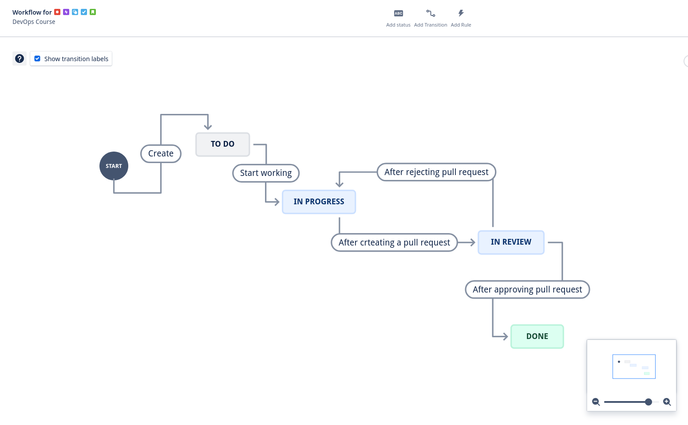

# GitHub-Jira Integration with Automation Rules

## 📌 Project Overview
This project demonstrates how to integrate **GitHub** with **Jira** using the **GitHub for Jira** app and configure automation rules to streamline issue tracking in a **SCRUM** workflow.

By linking GitHub commits, branches, and pull requests (PRs) with Jira issues, you can automate issue transitions based on development activities, reducing manual effort and improving workflow efficiency.

## 🚀 Features
- **GitHub for Jira Integration**: Connects a GitHub repository with Jira.
- **Automated Issue Transitions**: Automates issue movements in Jira based on GitHub activities.
- **SCRUM Workflow Alignment**: Ensures issues follow the standard SCRUM process.

## 🔧 Setup Instructions
### 1️⃣ Connect GitHub to Jira
1. Install the **GitHub for Jira** app from the Atlassian Marketplace.
2. Authorize the app to access your GitHub repository.
3. Link your Jira project to the GitHub repository.
You can find all the docs **[here](https://support.atlassian.com/jira-cloud-administration/docs/integrate-jira-software-with-github/)**

### 2️⃣ Use Jira Work Item Keys in GitHub
To enable Jira to track commits, branches, and PRs, include the **Jira issue key** in:
- Commit messages (e.g., `feat: Implement login functionality PROJ-123`)
- Branch names (e.g., `feature/PROJ-123-login-page`)
- PR titles (e.g., `Fix signup form validation PROJ-456`)

### 3️⃣ Automation Rules Configuration
The following Jira automation rules have been set up:
- **Branch Creation → Issue Transition**
  - 📌 When a branch is created, the issue moves from **TO DO** → **IN PROGRESS**.
- **Pull Request Creation → Issue Transition**
  - 📌 When a PR is opened, the issue moves from **IN PROGRESS** → **IN REVIEW**.
- **Pull Request Declined → Issue Transition**
  - 📌 When a PR is declined, the issue moves from **IN REVIEW** → **IN PROGRESS**.
- **Pull Request Merged → Issue Transition**
  - 📌 When a PR is merged, the issue moves from **IN REVIEW** → **DONE**.

## 4️⃣ Created Workflow
The following image illustrates the configured Jira workflow:



## 📂 Folder Structure
```
├── docs/            # Documentation and setup guides
├── README.md        # Project documentation (this file)
```

## 🛠 Technologies Used
- **Jira Software** for issue tracking
- **GitHub** for version control
- **GitHub for Jira** for integration
- **Jira Automation Rules** for workflow automation

## 🏆 Benefits
✔️ Reduces manual effort in tracking issues
✔️ Aligns development activities with Jira issues
✔️ Improves visibility into project progress
✔️ Enhances team collaboration

## 🙌 Contributing
Contributions are welcome! If you'd like to enhance this project, feel free to submit a PR.

## 📧 Contact
For any questions or suggestions, feel free to reach out!

---
⚡ **Happy Coding!** ⚡


